# How to Create an Auto Scaled and Load Balanced EC2 by using CloudFormation

This tutorial will create an ASG Behind an ALB with LC and Policy

1. Open VsCode and create a yaml file and name it `MyASGwithALB.yaml`

2. `Create a cloudformation template.`Enter `cfn` and VsCode will bring you options to choose that area related to cfn.
Choose the first one that is entitle `cfn`.

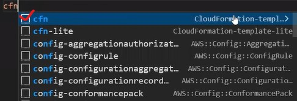

3. Remove Metadata, Conditions, and Transfrom as we will not use them. After removing you will have 5 sections.

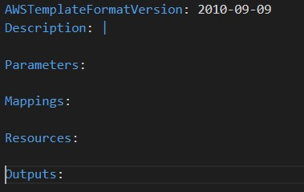

```bash
Important Note: Only Resources is a required section. The rest is optional
```
4. First fill in the description part to provide information regarding the template

```bash
 Description:This template creates an Auto Scaling Group that works behind an Elastic Load Balancer.
 ```
5. `Create a security group under Resources.` Enter security and VsCode will bring you options to choose that area related to security.
Choose ec2-security groups.

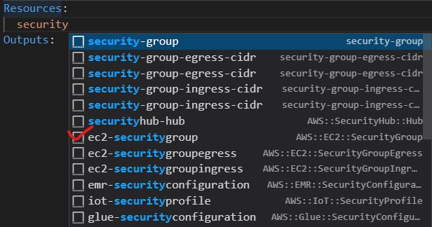

6. Remove GroupName, SecurityGroupEgress, and Tags as we will not use them.

```bash 
GroupsDescription is required
We removed Security Name because we can not specify security group id and securiy group name in the same request per AWS documentation rules.
Also for creating a non-default VPC you must use security group id. If we create new VPC in the future, we can use this template.
```
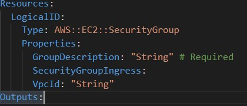

7. a) Change the logical id to `MySecGroup` and enter group description
   
```bash
GroupDescription: This group enables SSH and HTTP connections
```
8. `Add inbound rules for SecurityGroup Ingress to allow ports 22 and 80.` 
Enter security under SecurityGroupIngress and choose the one that includes ingres-cidr.

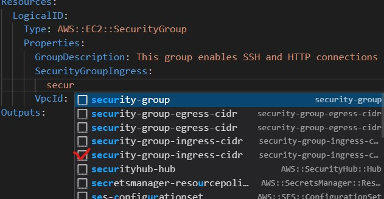

9. Fill the form with necessary information to make it work with ports 22 and 80.
```bash
Important Note: IpProtocol is list type so add a hypen before IpProtocol
```
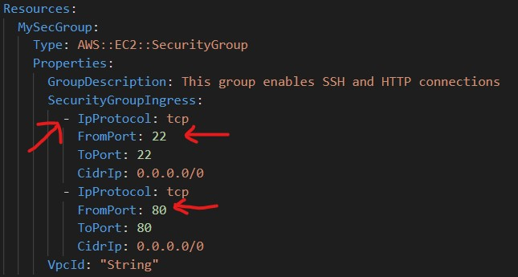

10. `Create a target group.`Enter target and choose elasticloadbalancingv2-target.

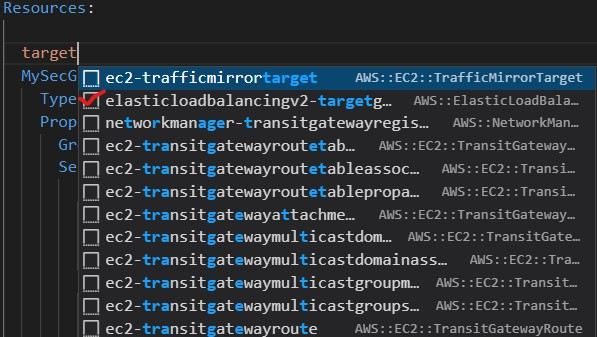

```bash
Important Note: V1 is for the classic load balancer targets while V2 is for the rest of the load balancer options, such as application load balancer.
```

11. Remove the unnecessary parts from the target group as we will not use them.

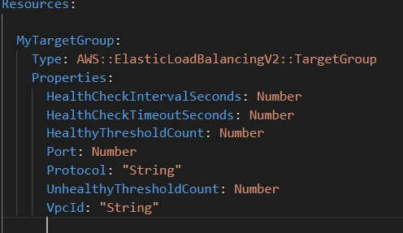

12. `Change the logicalId to MyTargetGroup`
 
13. Fill the template to work on port 80 with HTTP protovol. Choose healty threshold as 5 and unhealty threshold as 3,
while the healthcheck interval is set to 10 seconds and timeout set to 5 seconds.

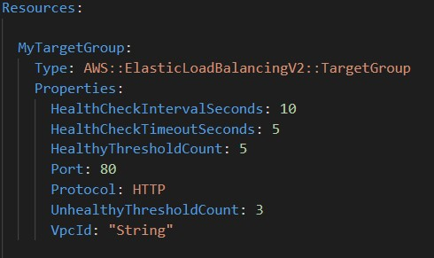

14. `Create a launcg template.`Enter launch and choose ec2-launchtemplate

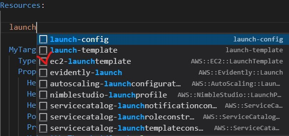

15. Remove the unnecessary sections as we will not use them.

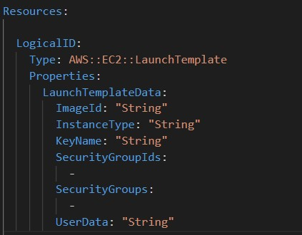

16. Change the logicalid to MyLaunchTemplate

17. Add user data. To add user data enter Base and choose the base64 function.

```bash
Important Notice: The user data must be base64-encoded to work on CloudFormation.
Hint: Intrinsic function Fn:Base64 helps us encode the text to base64
```
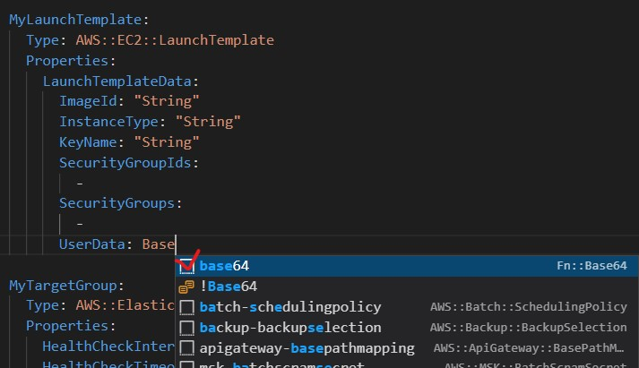

18. After base64 add a pipe | enter the user data.

```bash

#! /bin/bash
yum update -y
yum install -y httpd
TOKEN=`curl -X PUT "http://169.254.169.254/latest/api/token" -H "X-aws-ec2-metadata-token-ttl-seconds: 21600"` \
&& PRIVATE_IP=`curl -H "X-aws-ec2-metadata-token: $TOKEN" http://169.254.169.254/latest/meta-data/local-ipv4`
TOKEN=`curl -X PUT "http://169.254.169.254/latest/api/token" -H "X-aws-ec2-metadata-token-ttl-seconds: 21600"` \
&& PUBLIC_IP=`curl -H "X-aws-ec2-metadata-token: $TOKEN" http://169.254.169.254/latest/meta-data/public-ipv4` 
DATE_TIME=`date`
chmod -R 777 /var/www/html
echo "<html>
<head>
    <title> Congratulations! You have created an instance from Launch Template</title>
</head>
<body>
    <h1>This web server is launched from launch template by MEHMET</h1>
    <p>This instance is created at <b>$DATE_TIME</b></p>
    <p>Private IP address of this instance is <b>$PRIVATE_IP</b></p>
    <p>Public IP address of this instance is <b>$PUBLIC_IP</b></p>
</body>
</html>" > /var/www/html/index.html
systemctl start httpd
systemctl enable httpd
```
19. Use parameters to receive user input when selecting options, such as AMI type, instance type, and key pairs.
Enter parameter and choose parameter.

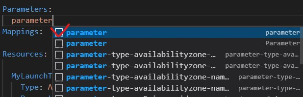

20. Change ParameterName to InstanceType, add a description and choose t2.micro as default instance type. Add a section `AllowedValues`to add 4 more instance types to choose from.

```bash
Description: Select your instance type
```
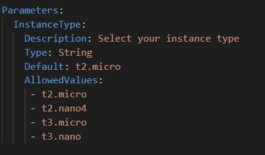

21. Link instancetype on the launch template with the instance type parameter to make sure that the launch template receives input from the parameters.

```bash
Use !Ref to link them.
```
```bash
Important Note: In the resources part,the name after Ref must match with the logicalId name in the parameter.
```
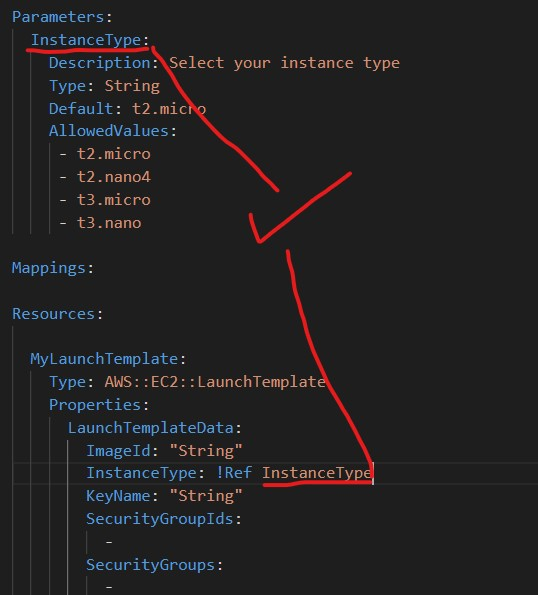

22. Use parameters to receive user input when selecting key pairs.
Enter keypair under Parameters and choose parameter-type-keypair option.

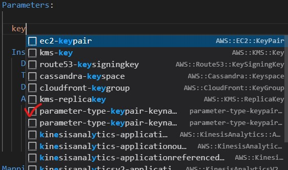

23. Change paramName as MyKeyPair and enter a description. Also remove default

```bash
Select your key pair
```
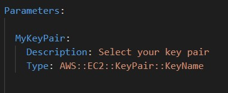

24. Link key pair name under parameters with the KeyName under Resources using Ref function

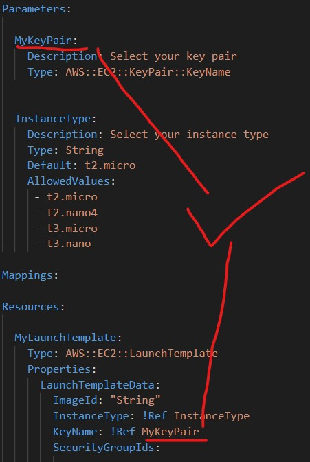

25. Use mappings to choose AZ s that we want EC2 instances to work on

```bash
Important Note: If you want to have a generic template that you can use in many regions, you can use mapings to specify them.
You can show which AMI to be used in which region. AWS will check your region and use the AMI in that region after mapping
```
26. Enter map and choose map under mappings.

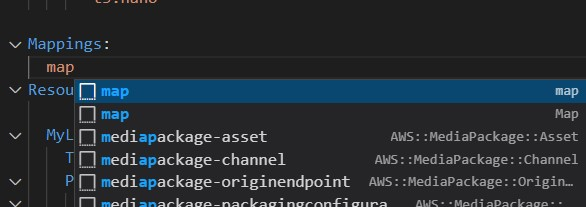

27. Change mapName as RegionImageMap, change mapping01 as us-east-1, mapping02 s us-east-2 and add more fields for us-west-1, us-west-2, and eu-west-1.
Also change Name as AMI and value01 as the AMI id for the corresponding region. Remove key01 lines.

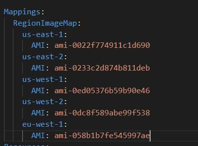

28. Use Find in Map function to choose the regions.
```bash
Important Note: The intrinsic function Fn::FindInMap returns value corresponding to keys in a two level map that is declared in the mappings section.
Note: The mapping we declared is a two level map. First level is region name second level is ami id
```
29. `Under Resources use Findinmap function to return image ids.`Enter find and choose FindInMap

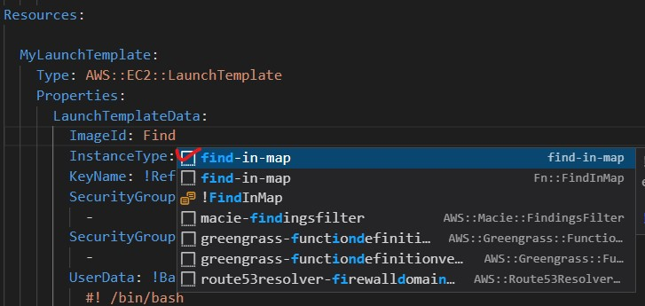

30. Change  MappingName as RegionImageMap, change keyname as !Ref AWS::Region:, change  value as AMI
```bash
For the keyname part we used a Pseudo parameter referance. Because we want AWS to check the region we are working on and use that region as the keyname.
```
```bash
Also instead of brackets to denote a list, use -hypen
```
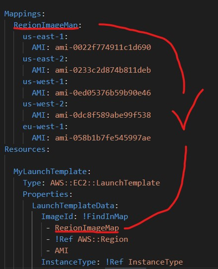

31. Link security groups in the Resources list to launch template in the resources list.
If you have not deleted, delete SecurityGroups in the launch template as we will not use them.
Since we have used id instead of name we cannot use ref as ref finds names and values.

32. Use !GetAtt to retrieve security ids.
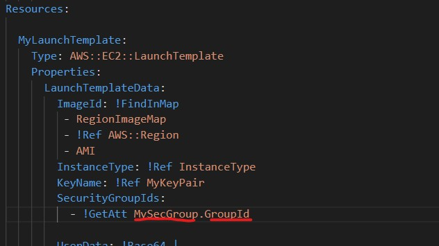

```bash
Important Note: When using getatt first write the resource name than dot.attribute
```

33. `Add Listener for Elastic Load Balance`. Enter listener under Resources to add Elastic laod balance listener

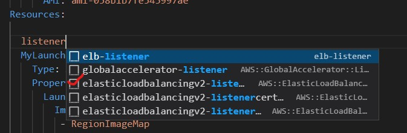

34. Remove AlpnPolicy, Certificates, and ASsl Policy as we will not use them.

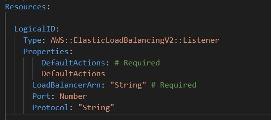

35. Ensure that the listener forwards to my target group which I created earlier by using ref function. Also ensure that loadbalancerArn uses the application load balancer that we will created next.

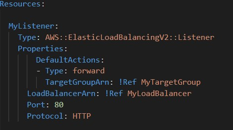

36. `Add autoscaling group.` Enter autoscaling and choose autoscalinggroups.

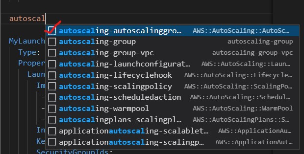

37. Remove AutoScalingGroupName,CapacityRebalance,Context,  Cooldown,DefaultInstanceWarmup,DesiredCapacityType, InstanceId,   LaunchConfigurationName,LifecycleHookSpecificationList,       LifecycleHookSpecificationList,LoadBalancerNames,    LoadBalancerNames,MaxInstanceLifetime,MetricsCollection,MixedInstancesPolicy,NewInstancesProtectedFromScaleIn,     NotificationConfigurations,PlacementGroup,      ServiceLinkedRoleARN,Tags,TerminationPolicies, and      VPCZoneIdentifier.

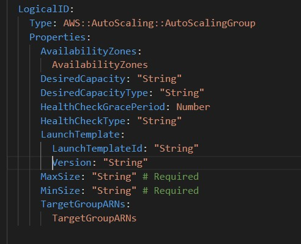

38. `Change logical id to MyAutoSG`

39. Link Availability Zones by using !GetAzs function.

```bash
AvailabilityZones: !GetAZs 
```

40. Complete the rest of the template.

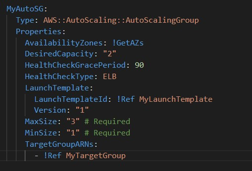

41. Enter an auto scaling policy. Write autoscaling and choose autoscalingpolicy.

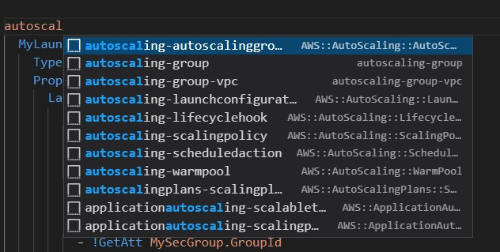

42. Remove unnecessary sections and complete the template.

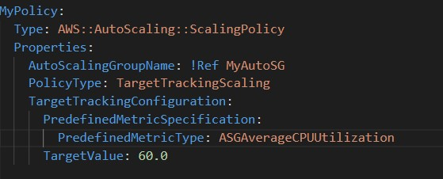

43. `Create a load balancer .`Enter load and choose elastic load balancing v2.

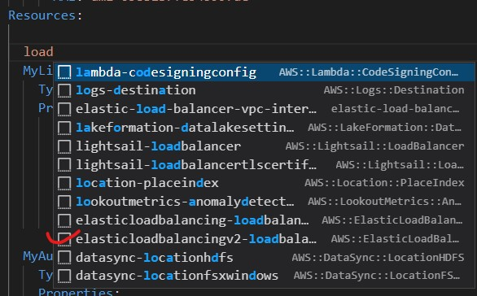

44. Change logical id to MyLoadBalancer, remove sections other than SecurityGroups,Subnets, and Type as we will not use them.

45. Enter application for the `type`.

46. For the subnets we can use Ref function to call subnets from the parameters section. `So create subnets under parameters section.`Enter subnet and choose parameter-subnet.

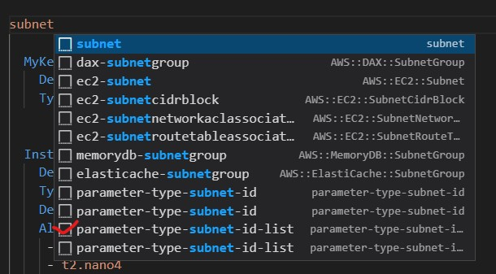

47. Change paramName to MySubnet and enter description. Also remove default section

```bash
Description:Select at least two subnets
```

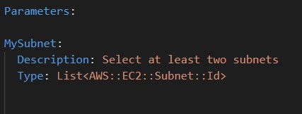

48. Go back to MyLoadBalancer and link the MySubnet by using ref function.

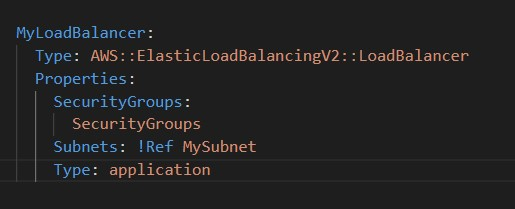

49. Link security group id to MyLoadBalancer by using GetAtt function.

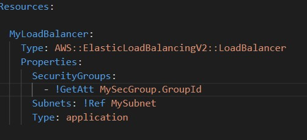

50. Create a vpc parameter under parameters section. Write vp and choose parameter-vpc-type.

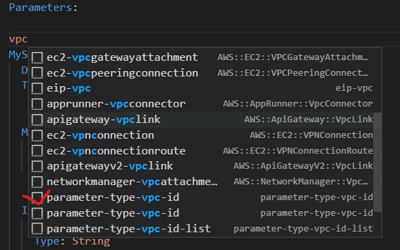

51. Change paramName to MyVpc and enter descirption. Also remove default option.

```bash
Description: Select your VPC
```
52. Go to target group and security group sections and link the vpc to the VpcId sections there.

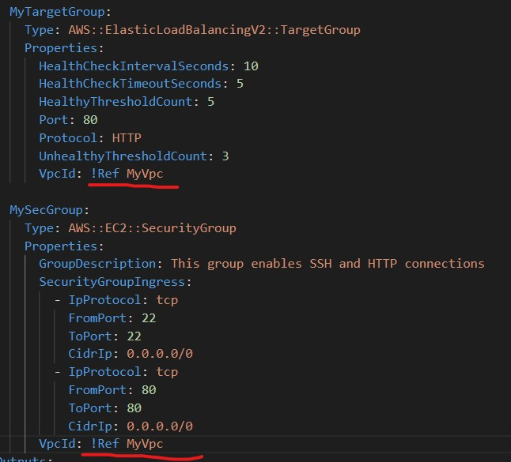

53. `Create an output to be presented at the end of processess on CloudFormation.`Enter output and choose output.

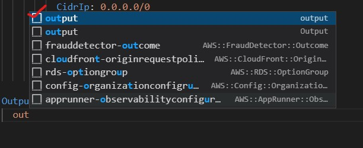

54. Change logcicalId to ALBURL and enter a description. Also remove Export and Name.
```bash
Description: URL of the ALB
```

55. Use GetAtt to retrive DNS name of the ALB. Also use Join function to append DNS names

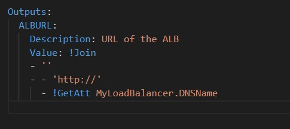

56. Check the template for typos, correct them if any, and save the form.

57. Go to the Console and open CloudFormation

58. Click on Create stack

59. Choose Template is ready and upload the yaml file that we just created and click next.

60. Name the stack choose instance type,  keypair, subnets and vpc. Choose all the subnets and the default vpc and click next

61. Leave the next page as is and click next again

62. Click create stack

63. Check the events tab to monitor the stack

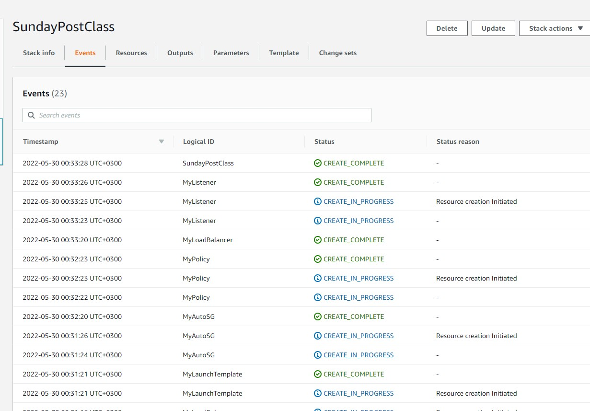

64. Check the output tab to see the url

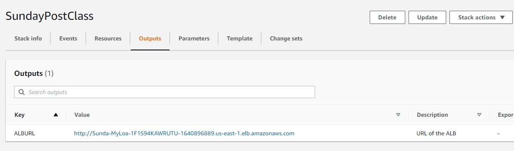


65. Delete the stack and everything will be terminated

```bash
Important Notice: Do not manually terminate instances via Ec2 because Auto sclaing will spin up new instances.
```

